Analysis for consensusDE paper - airway RNA-seq
================
Ashley J. Waardenberg
30/10/2019

-   [Notes](#notes)
-   [libraries used for analysis](#libraries-used-for-analysis)
-   [functions used for analysis](#functions-used-for-analysis)
-   [Analysis of RNA-seq data with consensusDE](#analysis-of-rna-seq-data-with-consensusde)
-   [Jaccard Coefficient and Set Sizes](#jaccard-coefficient-and-set-sizes)
-   [Mean LogFC standard deviation of sets](#mean-logfc-standard-deviation-of-sets)
-   [LogFC goodness of fit - extract statistics](#logfc-goodness-of-fit---extract-statistics)
-   [LogFC goodness of fit - without RUV](#logfc-goodness-of-fit---without-ruv)
-   [LogFC goodness of fit - with RUV](#logfc-goodness-of-fit---with-ruv)
-   [Blant Altman analysis](#blant-altman-analysis)
-   [Blant - Altman plots a](#blant---altman-plots-a)
-   [add Blant - Altman plots and t-tests - with RUV](#add-blant---altman-plots-and-t-tests---with-ruv)
-   [sessionInfo](#sessioninfo)
-   [functions used](#functions-used)

Notes
=====

30-10-2019 + modifications in response to reviewers comments + updated to consensusDE version 1.3.4 + addition of bland-altman analyses

30-06-2019 + updated for compatability with consensusDE version 1.3.3 + setting of norm\_method = "all\_defaults" for multi\_de\_pairs

libraries used for analysis
===========================

``` r
library(consensusDE)
library(airway)
library(lattice)
library(blandr)
data(airway)
```

functions used for analysis
===========================

``` r
source("./functions/return_airway_stats.r")
```

Analysis of RNA-seq data with consensusDE
=========================================

``` r
# establishment of data for pair-wise analysis
colData(airway)$group <- colData(airway)$dex
colData(airway)$file <- rownames(colData(airway))

# read into a summarized experiment, with low counts filtered
airway_filter <- buildSummarized(summarized = airway,
                                 filter = TRUE)

# run DE analysis with RUV
airway_ruv <- multi_de_pairs(summarized = airway_filter,
                             norm_method = "all_defaults",
                             ruv_correct = TRUE)

# run DE analysis without RUV
airway_NOruv <- multi_de_pairs(summarized = airway_filter,
                               norm_method = "all_defaults",
                               ruv_correct = FALSE)
```

Jaccard Coefficient and Set Sizes
=================================

``` r
# extract cde statistics
non_ruv <- return_cde_stats(airway_NOruv)
ruv <- return_cde_stats(airway_ruv)

# Jaccard coefficients
JC_stats <- rbind(unlist(non_ruv$props),
                  unlist(ruv$props)
                  )
rownames(JC_stats) <- c("non_RUV", "RUV")

#print results
JC_stats
```

    ##                ER        DE        VM
    ## non_RUV 0.8174078 0.6290499 0.9201278
    ## RUV     0.8565588 0.7524693 0.9229075

``` r
# set sizes
non_ruv_set_size <- c(length(non_ruv$venn_input$VM),
                      length(non_ruv$venn_input$DE),
                      length(non_ruv$venn_input$ER),
                      length(non_ruv$intersect))

ruv_set_size <- c(length(ruv$venn_input$VM),
                  length(ruv$venn_input$DE),
                  length(ruv$venn_input$ER),
                  length(ruv$intersect))

# percetage increases (nonRUV to RUV)
percent_diff <- c((length(ruv$venn_input$VM)-length(non_ruv$venn_input$VM))/length(ruv$venn_input$VM),
                  (length(ruv$venn_input$DE)-length(non_ruv$venn_input$DE))/length(ruv$venn_input$DE),
                  (length(ruv$venn_input$ER)-length(non_ruv$venn_input$ER))/length(ruv$venn_input$ER),
                  (length(ruv$intersect)-length(non_ruv$intersect))/length(ruv$intersect))

set_sizes <- rbind(non_ruv_set_size,
                   ruv_set_size,
                   percent_diff)

colnames(set_sizes) <- c("voom", "DESeq2", "edgeR", "intersect")
rownames(set_sizes) <- c("non_RUV", "RUV", "percent_diff")

# print results
set_sizes
```

    ##                      voom       DESeq2        edgeR    intersect
    ## non_RUV      1878.0000000 2747.0000000 2114.0000000 1728.0000000
    ## RUV          2724.0000000 3341.0000000 2935.0000000 2514.0000000
    ## percent_diff    0.3105727    0.1777911    0.2797274    0.3126492

Mean LogFC standard deviation of sets
=====================================

``` r
mean_sd <- rbind(c(mean(abs(non_ruv$ER$LogFC_sd)),
                   mean(abs(non_ruv$VM$LogFC_sd)),
                   mean(abs(non_ruv$DE$LogFC_sd))),
                 c(mean(abs(ruv$ER$LogFC_sd)),
                   mean(abs(ruv$VM$LogFC_sd)),
                   mean(abs(ruv$DE$LogFC_sd))))

colnames(mean_sd) <- c("edgeR", "voom", "DESeq2")
rownames(mean_sd) <- c("non_RUV", "RUV")

# print results
mean_sd
```

    ##              edgeR       voom     DESeq2
    ## non_RUV 0.02133190 0.01693218 0.01795723
    ## RUV     0.01562589 0.01318950 0.01321216

``` r
# of the non-intersecting sets for each algorithm
mean_sd_not_intersect <- rbind(c(mean(abs(non_ruv$ER[!non_ruv$ER$ID %in% non_ruv$intersect,]$LogFC_sd)),
                                 mean(abs(non_ruv$VM[!non_ruv$VM$ID %in% non_ruv$intersect,]$LogFC_sd)),
                                 mean(abs(non_ruv$DE[!non_ruv$DE$ID %in% non_ruv$intersect,]$LogFC_sd))),
                               c(mean(abs(ruv$ER[!ruv$ER$ID %in% ruv$intersect,]$LogFC_sd)),
                                 mean(abs(ruv$VM[!ruv$VM$ID %in% ruv$intersect,]$LogFC_sd)),
                                 mean(abs(ruv$DE[!ruv$DE$ID %in% ruv$intersect,]$LogFC_sd))))

colnames(mean_sd_not_intersect) <- c("edgeR", "voom", "DESeq2")
rownames(mean_sd_not_intersect) <- c("non_RUV", "RUV")

# print results
mean_sd_not_intersect
```

    ##              edgeR       voom     DESeq2
    ## non_RUV 0.03929638 0.01247605 0.01903953
    ## RUV     0.02747661 0.00778035 0.01190751

``` r
# overall intersect
mean_sd_intersect <- c(mean(abs(non_ruv$DE[non_ruv$DE$ID %in% non_ruv$intersect,]$LogFC_sd)),
                       mean(abs(ruv$DE[ruv$DE$ID %in% ruv$intersect,]$LogFC_sd)))

names(mean_sd_intersect) <- c("non_RUV", "RUV")

# print results
mean_sd_intersect
```

    ##    non_RUV        RUV 
    ## 0.01731900 0.01364134

``` r
# overall union
mean_sd_union <- c(mean(abs(unique(rbind(non_ruv$ER,non_ruv$VM,non_ruv$DE)$LogFC_sd))),
                   mean(abs(unique(rbind(ruv$ER,ruv$VM,ruv$DE)$LogFC_sd))))
names(mean_sd_union) <- c("non_RUV", "RUV")

# print results
mean_sd_union
```

    ##    non_RUV        RUV 
    ## 0.01869146 0.01413187

LogFC goodness of fit - extract statistics
==========================================

``` r
# extract statistics
all_FC <- get_merged_logfc(airway_NOruv)
all_FC_ruv <- get_merged_logfc(airway_ruv)
```

LogFC goodness of fit - without RUV
===================================

``` r
# extract logFC values for edgeR, voom and DESeq2
# using R-squared for comparison

# 1. Voom vs. DESeq2
plot(all_FC$logFC_VM, 
     all_FC$logFC_DE, 
     xlab="voom - logFC", 
     ylab="DESeq2 - logFC")
```

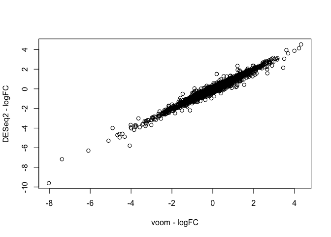

``` r
summary(lm(all_FC$logFC_VM~all_FC$logFC_DE))
```

    ## 
    ## Call:
    ## lm(formula = all_FC$logFC_VM ~ all_FC$logFC_DE)
    ## 
    ## Residuals:
    ##      Min       1Q   Median       3Q      Max 
    ## -1.30193 -0.01724 -0.00804  0.00671  1.60902 
    ## 
    ## Coefficients:
    ##                  Estimate Std. Error t value Pr(>|t|)    
    ## (Intercept)     0.0132990  0.0006389   20.82   <2e-16 ***
    ## all_FC$logFC_DE 0.9822373  0.0011410  860.87   <2e-16 ***
    ## ---
    ## Signif. codes:  0 '***' 0.001 '**' 0.01 '*' 0.05 '.' 0.1 ' ' 1
    ## 
    ## Residual standard error: 0.08062 on 15924 degrees of freedom
    ## Multiple R-squared:  0.979,  Adjusted R-squared:  0.979 
    ## F-statistic: 7.411e+05 on 1 and 15924 DF,  p-value: < 2.2e-16

``` r
# 2. Voom vs. edgeR
plot(all_FC$logFC_VM, 
     all_FC$logFC_ER,
     xlab="voom - logFC", 
     ylab="edgeR - logFC")
```

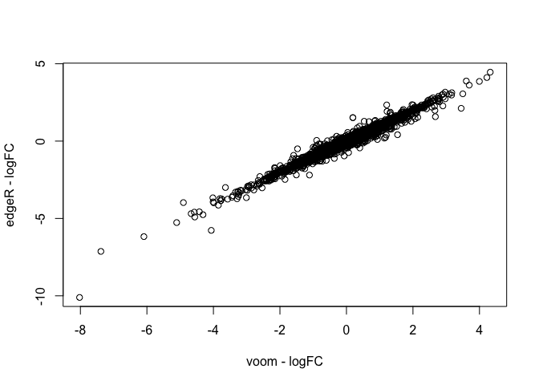

``` r
summary(lm(all_FC$logFC_VM~all_FC$logFC_ER))
```

    ## 
    ## Call:
    ## lm(formula = all_FC$logFC_VM ~ all_FC$logFC_ER)
    ## 
    ## Residuals:
    ##      Min       1Q   Median       3Q      Max 
    ## -1.30755 -0.01756 -0.00821  0.00671  1.91259 
    ## 
    ## Coefficients:
    ##                  Estimate Std. Error t value Pr(>|t|)    
    ## (Intercept)     0.0099360  0.0006436   15.44   <2e-16 ***
    ## all_FC$logFC_ER 0.9843375  0.0011520  854.47   <2e-16 ***
    ## ---
    ## Signif. codes:  0 '***' 0.001 '**' 0.01 '*' 0.05 '.' 0.1 ' ' 1
    ## 
    ## Residual standard error: 0.08122 on 15924 degrees of freedom
    ## Multiple R-squared:  0.9787, Adjusted R-squared:  0.9787 
    ## F-statistic: 7.301e+05 on 1 and 15924 DF,  p-value: < 2.2e-16

``` r
# 3. edgeR vs. DESeq2
plot(all_FC$logFC_ER, 
     all_FC$logFC_DE, 
     xlab="edgeR - logFC", 
     ylab="DESeq2 - logFC")
```

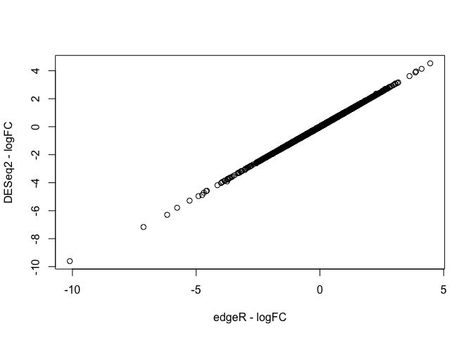

``` r
summary(lm(all_FC$logFC_ER~all_FC$logFC_DE))
```

    ## 
    ## Call:
    ## lm(formula = all_FC$logFC_ER ~ all_FC$logFC_DE)
    ## 
    ## Residuals:
    ##      Min       1Q   Median       3Q      Max 
    ## -0.52743 -0.00084  0.00013  0.00106  0.14335 
    ## 
    ## Coefficients:
    ##                  Estimate Std. Error  t value Pr(>|t|)    
    ## (Intercept)     3.417e-03  4.651e-05    73.46   <2e-16 ***
    ## all_FC$logFC_DE 9.977e-01  8.306e-05 12011.37   <2e-16 ***
    ## ---
    ## Signif. codes:  0 '***' 0.001 '**' 0.01 '*' 0.05 '.' 0.1 ' ' 1
    ## 
    ## Residual standard error: 0.005869 on 15924 degrees of freedom
    ## Multiple R-squared:  0.9999, Adjusted R-squared:  0.9999 
    ## F-statistic: 1.443e+08 on 1 and 15924 DF,  p-value: < 2.2e-16

LogFC goodness of fit - with RUV
================================

``` r
# extract logFC values for edgeR, voom and DESeq2
# using R-squared for comparison

# 1. Voom vs. DESeq2
plot(all_FC_ruv$logFC_VM, 
     all_FC_ruv$logFC_DE, 
     xlab="voom - logFC", 
     ylab="DESeq2 - logFC")
```


``` r
summary(lm(all_FC_ruv$logFC_VM~all_FC_ruv$logFC_DE))
```

    ## 
    ## Call:
    ## lm(formula = all_FC_ruv$logFC_VM ~ all_FC_ruv$logFC_DE)
    ## 
    ## Residuals:
    ##      Min       1Q   Median       3Q      Max 
    ## -1.07048 -0.00970 -0.00203  0.00656  1.40422 
    ## 
    ## Coefficients:
    ##                      Estimate Std. Error t value Pr(>|t|)    
    ## (Intercept)         0.0058481  0.0004775   12.25   <2e-16 ***
    ## all_FC_ruv$logFC_DE 0.9914890  0.0008559 1158.48   <2e-16 ***
    ## ---
    ## Signif. codes:  0 '***' 0.001 '**' 0.01 '*' 0.05 '.' 0.1 ' ' 1
    ## 
    ## Residual standard error: 0.06025 on 15924 degrees of freedom
    ## Multiple R-squared:  0.9883, Adjusted R-squared:  0.9883 
    ## F-statistic: 1.342e+06 on 1 and 15924 DF,  p-value: < 2.2e-16

``` r
# 2. Voom vs. edgeR
plot(all_FC_ruv$logFC_VM, 
     all_FC_ruv$logFC_ER,
     xlab="voom - logFC", 
     ylab="edgeR - logFC")
```

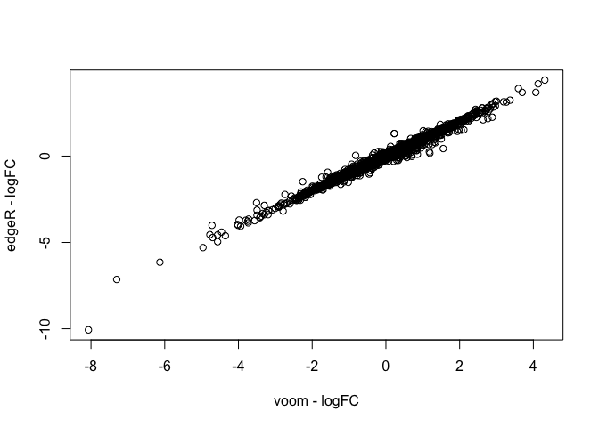

``` r
summary(lm(all_FC_ruv$logFC_VM~all_FC_ruv$logFC_ER))
```

    ## 
    ## Call:
    ## lm(formula = all_FC_ruv$logFC_VM ~ all_FC_ruv$logFC_ER)
    ## 
    ## Residuals:
    ##      Min       1Q   Median       3Q      Max 
    ## -1.07644 -0.00964 -0.00219  0.00627  1.94077 
    ## 
    ## Coefficients:
    ##                      Estimate Std. Error  t value Pr(>|t|)    
    ## (Intercept)         0.0024585  0.0004789    5.134 2.87e-07 ***
    ## all_FC_ruv$logFC_ER 0.9947762  0.0008611 1155.291  < 2e-16 ***
    ## ---
    ## Signif. codes:  0 '***' 0.001 '**' 0.01 '*' 0.05 '.' 0.1 ' ' 1
    ## 
    ## Residual standard error: 0.06042 on 15924 degrees of freedom
    ## Multiple R-squared:  0.9882, Adjusted R-squared:  0.9882 
    ## F-statistic: 1.335e+06 on 1 and 15924 DF,  p-value: < 2.2e-16

``` r
# 3. edgeR vs. DESeq2
plot(all_FC_ruv$logFC_ER, 
     all_FC_ruv$logFC_DE, 
     xlab="edgeR - logFC", 
     ylab="DESeq2 - logFC")
```


``` r
summary(lm(all_FC_ruv$logFC_ER~all_FC_ruv$logFC_DE))
```

    ## 
    ## Call:
    ## lm(formula = all_FC_ruv$logFC_ER ~ all_FC_ruv$logFC_DE)
    ## 
    ## Residuals:
    ##      Min       1Q   Median       3Q      Max 
    ## -0.54069 -0.00075  0.00019  0.00106  0.19056 
    ## 
    ## Coefficients:
    ##                      Estimate Std. Error t value Pr(>|t|)    
    ## (Intercept)         0.0034086  0.0000644   52.93   <2e-16 ***
    ## all_FC_ruv$logFC_DE 0.9965569  0.0001154 8633.86   <2e-16 ***
    ## ---
    ## Signif. codes:  0 '***' 0.001 '**' 0.01 '*' 0.05 '.' 0.1 ' ' 1
    ## 
    ## Residual standard error: 0.008126 on 15924 degrees of freedom
    ## Multiple R-squared:  0.9998, Adjusted R-squared:  0.9998 
    ## F-statistic: 7.454e+07 on 1 and 15924 DF,  p-value: < 2.2e-16

Blant Altman analysis
=====================

``` r
# bias of mean differences (or level of mean agreement)

all_FC_BA <- data.frame("v_de" = c(blandr.statistics(all_FC$logFC_VM , all_FC$logFC_DE, sig.level=0.95)$bias,
                                   blandr.statistics(all_FC_ruv$logFC_VM , all_FC_ruv$logFC_DE, sig.level=0.95)$bias),
                        "v_er" = c(blandr.statistics(all_FC$logFC_VM , all_FC$logFC_ER, sig.level=0.95)$bias,
                                   blandr.statistics(all_FC_ruv$logFC_VM , all_FC_ruv$logFC_ER, sig.level=0.95)$bias),
                        "de_er" = c(blandr.statistics(all_FC$logFC_DE , all_FC$logFC_ER, sig.level=0.95)$bias,
                                    blandr.statistics(all_FC_ruv$logFC_DE , all_FC_ruv$logFC_ER, sig.level=0.95)$bias))

row.names(all_FC_BA) <- c("nonRUV", "RUV")

#print results
all_FC_BA
```

    ##               v_de        v_er        de_er
    ## nonRUV 0.013289555 0.009874157 -0.003415398
    ## RUV    0.005772086 0.002394243 -0.003377842

``` r
# limits of agreement (boundaries of agreement values between the different methods @ 95%)
# upperLOA and lowerLOA

FC_BA_upperLOA <- data.frame("v_de" = c(blandr.statistics(all_FC$logFC_VM , all_FC$logFC_DE, sig.level=0.95)$upperLOA,
                                       blandr.statistics(all_FC_ruv$logFC_VM , all_FC_ruv$logFC_DE, sig.level=0.95)$upperLOA),
                            "v_er" = c(blandr.statistics(all_FC$logFC_VM , all_FC$logFC_ER, sig.level=0.95)$upperLOA,
                                       blandr.statistics(all_FC_ruv$logFC_VM , all_FC_ruv$logFC_ER, sig.level=0.95)$upperLOA),
                            "de_er" = c(blandr.statistics(all_FC$logFC_DE , all_FC$logFC_ER, sig.level=0.95)$upperLOA,
                                        blandr.statistics(all_FC_ruv$logFC_DE , all_FC_ruv$logFC_ER, sig.level=0.95)$upperLOA)
                            )

row.names(FC_BA_upperLOA) <- c("nonRUV", "RUV")
#print results
FC_BA_upperLOA
```

    ##             v_de      v_er       de_er
    ## nonRUV 0.1725068 0.1699728 0.008372534
    ## RUV    0.1242277 0.1209422 0.012987109

``` r
# barchart of results
FC_BA_upperLOA_bc <- data.frame("group" = names(unlist(FC_BA_upperLOA)),
                                "LOA" = unlist(FC_BA_upperLOA),
                                "reps" = rep(c("nonRUV", "RUV"),3))

barchart(LOA~group,
         data = FC_BA_upperLOA_bc,
         groups = reps,
         main = "upperLOA",
         auto.key = TRUE)
```

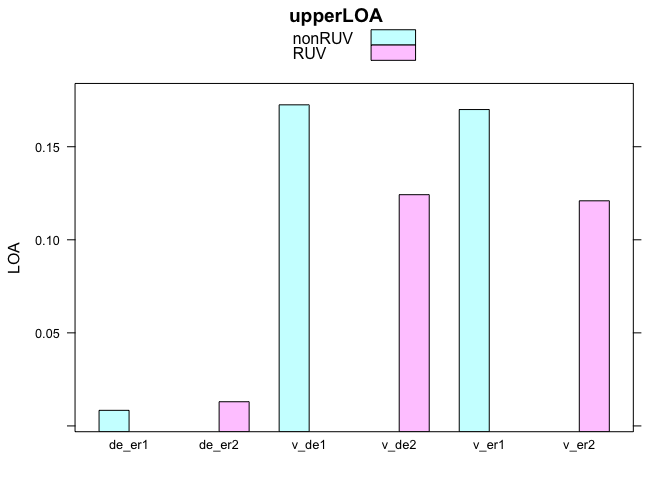

``` r
FC_BA_lowerLOA <- data.frame("v_de" = c(blandr.statistics(all_FC$logFC_VM , all_FC$logFC_DE, sig.level=0.95)$lowerLOA,
                                       blandr.statistics(all_FC_ruv$logFC_VM , all_FC_ruv$logFC_DE, sig.level=0.95)$lowerLOA),
                            "v_er" = c(blandr.statistics(all_FC$logFC_VM , all_FC$logFC_ER, sig.level=0.95)$lowerLOA,
                                       blandr.statistics(all_FC_ruv$logFC_VM , all_FC_ruv$logFC_ER, sig.level=0.95)$lowerLOA),
                            "de_er" = c(blandr.statistics(all_FC$logFC_DE , all_FC$logFC_ER, sig.level=0.95)$lowerLOA,
                                        blandr.statistics(all_FC_ruv$logFC_DE , all_FC_ruv$logFC_ER, sig.level=0.95)$lowerLOA)
                            )

row.names(FC_BA_lowerLOA) <- c("nonRUV", "RUV")
#print results
FC_BA_lowerLOA
```

    ##              v_de       v_er       de_er
    ## nonRUV -0.1459277 -0.1502245 -0.01520333
    ## RUV    -0.1126835 -0.1161537 -0.01974279

``` r
# barchart of results
FC_BA_lowerLOA_bc <- data.frame("group" = names(unlist(FC_BA_lowerLOA)),
                                "LOA" = abs(unlist(FC_BA_lowerLOA)),
                                "reps" = rep(c("nonRUV", "RUV"),3))

barchart(LOA~group,
         data = FC_BA_lowerLOA_bc,
         groups = reps,
         main = "lowerLOA",
         auto.key = TRUE)
```

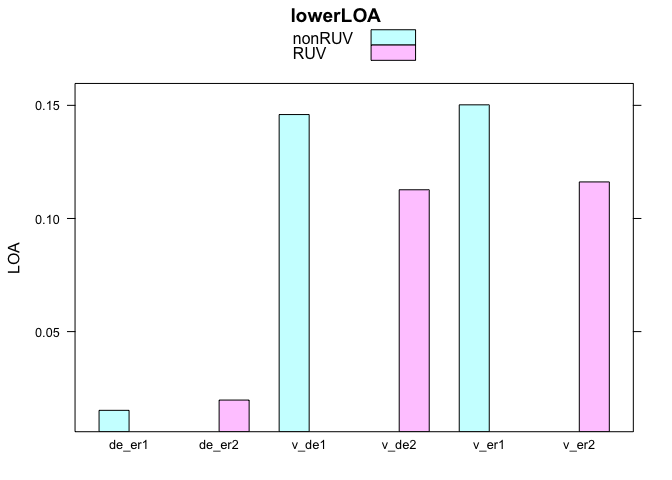

Blant - Altman plots a
======================

``` r
# plot results and determine statistics

# 1. Voom vs. DESeq2
blandr.draw(method1 = all_FC$logFC_VM, 
            method2 = all_FC$logFC_DE,
            plotTitle = "Bland-Altman, voom vs. DEseq2",
            annotate = TRUE,
            lowest_y_axis = -2,
            highest_y_axis = 2,
            plotter = "rplot")
```


``` r
# 2. Voom vs. edgeR
blandr.draw(method1 = all_FC$logFC_VM, 
            method2 = all_FC$logFC_ER,
            plotTitle = "Bland-Altman, voom vs. edgeR",
            annotate = TRUE,
            lowest_y_axis = -2,
            highest_y_axis = 2,
            plotter = "rplot")
```

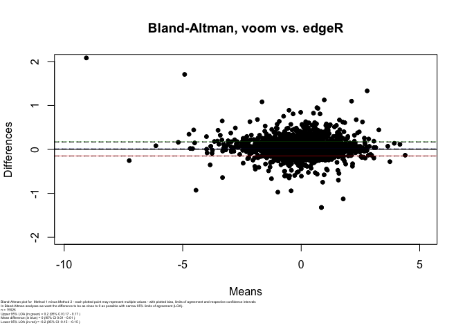

``` r
# 3. edgeR vs. DESeq2
blandr.draw(method1 = all_FC$logFC_ER, 
            method2 = all_FC$logFC_DE,
            plotTitle = "Bland-Altman, edgeR vs. DEseq2",
            annotate = TRUE,
            lowest_y_axis = -2,
            highest_y_axis = 2,
            plotter = "rplot")
```

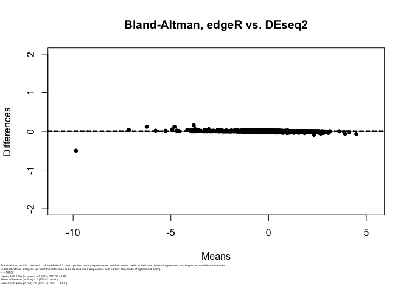

add Blant - Altman plots and t-tests - with RUV
===============================================

``` r
# 1. Voom vs. DESeq2
blandr.draw(method1 = all_FC_ruv$logFC_VM, 
            method2 = all_FC_ruv$logFC_DE,
            plotTitle = "Bland-Altman, voom vs. DEseq2",
            annotate = TRUE,
            lowest_y_axis = -2,
            highest_y_axis = 2,
            plotter = "rplot")
```

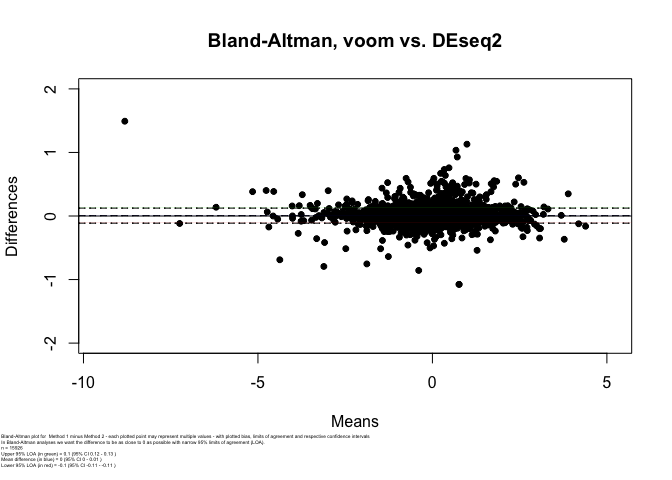

``` r
# 2. Voom vs. edgeR
blandr.draw(method1 = all_FC_ruv$logFC_VM, 
            method2 = all_FC_ruv$logFC_ER,
            plotTitle = "Bland-Altman, voom vs. edgeR",
            annotate = TRUE,
            lowest_y_axis = -2,
            highest_y_axis = 2,
            plotter = "rplot")
```

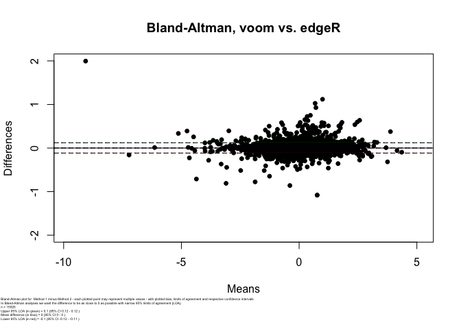

``` r
# 3. edgeR vs. DESeq2
blandr.draw(method1 = all_FC_ruv$logFC_ER, 
            method2 = all_FC_ruv$logFC_DE,
            plotTitle = "Bland-Altman, edgeR vs. DEseq2",
            annotate = TRUE,
            lowest_y_axis = -2,
            highest_y_axis = 2,
            plotter = "rplot")
```

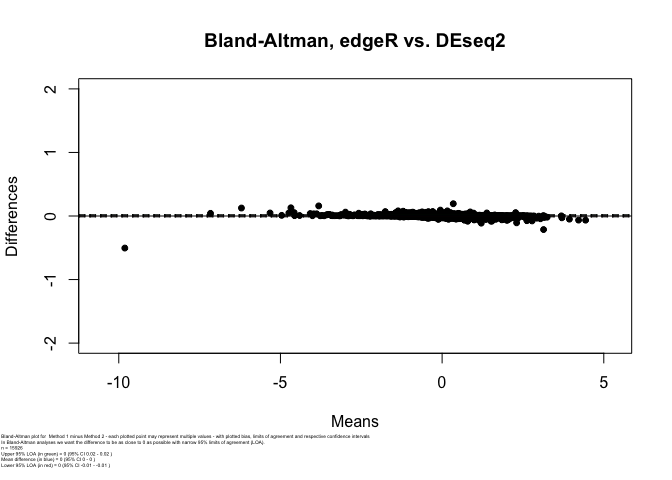

sessionInfo
===========

``` r
sessionInfo()
```

    ## R version 3.5.1 (2018-07-02)
    ## Platform: x86_64-apple-darwin15.6.0 (64-bit)
    ## Running under: macOS High Sierra 10.13.6
    ## 
    ## Matrix products: default
    ## BLAS: /Library/Frameworks/R.framework/Versions/3.5/Resources/lib/libRblas.0.dylib
    ## LAPACK: /Library/Frameworks/R.framework/Versions/3.5/Resources/lib/libRlapack.dylib
    ## 
    ## locale:
    ## [1] en_AU.UTF-8/en_AU.UTF-8/en_AU.UTF-8/C/en_AU.UTF-8/en_AU.UTF-8
    ## 
    ## attached base packages:
    ## [1] stats4    parallel  stats     graphics  grDevices utils     datasets 
    ## [8] methods   base     
    ## 
    ## other attached packages:
    ##  [1] blandr_0.5.1                lattice_0.20-35            
    ##  [3] airway_0.114.0              SummarizedExperiment_1.10.1
    ##  [5] DelayedArray_0.6.6          BiocParallel_1.16.6        
    ##  [7] matrixStats_0.54.0          Biobase_2.40.0             
    ##  [9] GenomicRanges_1.32.7        GenomeInfoDb_1.16.0        
    ## [11] IRanges_2.14.12             S4Vectors_0.18.3           
    ## [13] consensusDE_1.3.4           BiocGenerics_0.26.0        
    ## 
    ## loaded via a namespace (and not attached):
    ##   [1] jmvcore_1.0.8                            
    ##   [2] colorspace_1.3-2                         
    ##   [3] rjson_0.2.20                             
    ##   [4] hwriter_1.3.2                            
    ##   [5] htmlTable_1.12                           
    ##   [6] XVector_0.20.0                           
    ##   [7] base64enc_0.1-3                          
    ##   [8] rstudioapi_0.7                           
    ##   [9] bit64_0.9-7                              
    ##  [10] AnnotationDbi_1.44.0                     
    ##  [11] splines_3.5.1                            
    ##  [12] R.methodsS3_1.7.1                        
    ##  [13] DESeq_1.32.0                             
    ##  [14] geneplotter_1.58.0                       
    ##  [15] knitr_1.25                               
    ##  [16] Formula_1.2-3                            
    ##  [17] Rsamtools_1.34.1                         
    ##  [18] annotate_1.58.0                          
    ##  [19] cluster_2.0.7-1                          
    ##  [20] R.oo_1.22.0                              
    ##  [21] compiler_3.5.1                           
    ##  [22] httr_1.3.1                               
    ##  [23] backports_1.1.2                          
    ##  [24] assertthat_0.2.1                         
    ##  [25] Matrix_1.2-14                            
    ##  [26] lazyeval_0.2.2                           
    ##  [27] limma_3.36.5                             
    ##  [28] acepack_1.4.1                            
    ##  [29] htmltools_0.4.0                          
    ##  [30] prettyunits_1.0.2                        
    ##  [31] tools_3.5.1                              
    ##  [32] bindrcpp_0.2.2                           
    ##  [33] gtable_0.3.0                             
    ##  [34] glue_1.3.1                               
    ##  [35] GenomeInfoDbData_1.1.0                   
    ##  [36] dplyr_0.7.8                              
    ##  [37] ShortRead_1.38.0                         
    ##  [38] Rcpp_1.0.2                               
    ##  [39] TxDb.Dmelanogaster.UCSC.dm3.ensGene_3.2.2
    ##  [40] Biostrings_2.48.0                        
    ##  [41] rtracklayer_1.40.6                       
    ##  [42] xfun_0.10                                
    ##  [43] stringr_1.4.0                            
    ##  [44] ensembldb_2.6.7                          
    ##  [45] XML_3.98-1.16                            
    ##  [46] dendextend_1.12.0                        
    ##  [47] edgeR_3.22.5                             
    ##  [48] zlibbioc_1.26.0                          
    ##  [49] MASS_7.3-50                              
    ##  [50] scales_1.0.0                             
    ##  [51] aroma.light_3.10.0                       
    ##  [52] pcaMethods_1.72.0                        
    ##  [53] hms_0.4.2                                
    ##  [54] ProtGenerics_1.14.0                      
    ##  [55] AnnotationFilter_1.6.0                   
    ##  [56] RColorBrewer_1.1-2                       
    ##  [57] yaml_2.2.0                               
    ##  [58] curl_3.2                                 
    ##  [59] memoise_1.1.0                            
    ##  [60] RUVSeq_1.16.1                            
    ##  [61] gridExtra_2.3                            
    ##  [62] ggplot2_3.1.1                            
    ##  [63] biomaRt_2.36.1                           
    ##  [64] rpart_4.1-13                             
    ##  [65] latticeExtra_0.6-28                      
    ##  [66] stringi_1.4.3                            
    ##  [67] RSQLite_2.1.1                            
    ##  [68] genefilter_1.62.0                        
    ##  [69] checkmate_1.8.5                          
    ##  [70] GenomicFeatures_1.32.3                   
    ##  [71] rlang_0.4.0                              
    ##  [72] pkgconfig_2.0.2                          
    ##  [73] bitops_1.0-6                             
    ##  [74] evaluate_0.14                            
    ##  [75] purrr_0.2.5                              
    ##  [76] bindr_0.1.1                              
    ##  [77] GenomicAlignments_1.16.0                 
    ##  [78] htmlwidgets_1.2                          
    ##  [79] bit_1.1-14                               
    ##  [80] tidyselect_0.2.5                         
    ##  [81] plyr_1.8.4                               
    ##  [82] magrittr_1.5                             
    ##  [83] DESeq2_1.20.0                            
    ##  [84] R6_2.2.2                                 
    ##  [85] Hmisc_4.1-1                              
    ##  [86] DBI_1.0.0                                
    ##  [87] pillar_1.3.1                             
    ##  [88] foreign_0.8-71                           
    ##  [89] survival_2.42-6                          
    ##  [90] RCurl_1.95-4.12                          
    ##  [91] nnet_7.3-12                              
    ##  [92] tibble_2.1.1                             
    ##  [93] EDASeq_2.14.1                            
    ##  [94] crayon_1.3.4                             
    ##  [95] rmarkdown_1.16                           
    ##  [96] viridis_0.5.1                            
    ##  [97] progress_1.2.0                           
    ##  [98] locfit_1.5-9.1                           
    ##  [99] grid_3.5.1                               
    ## [100] data.table_1.12.2                        
    ## [101] blob_1.1.1                               
    ## [102] digest_0.6.21                            
    ## [103] xtable_1.8-3                             
    ## [104] R.utils_2.7.0                            
    ## [105] munsell_0.5.0                            
    ## [106] viridisLite_0.3.0

functions used
==============

printing for static reference

``` r
return_cde_stats
```

    ## function (input_pairs, p_cut = 0.05) 
    ## {
    ##     merged_data <- input_pairs$merged[[1]]
    ##     ER <- merged_data[merged_data$edger_adj_p <= p_cut, ]
    ##     DE <- merged_data[merged_data$deseq_adj_p <= p_cut, ]
    ##     VM <- merged_data[merged_data$voom_adj_p <= p_cut, ]
    ##     ER_ID <- as.character(ER$ID)
    ##     DE_ID <- as.character(DE$ID)
    ##     VM_ID <- as.character(VM$ID)
    ##     ER.DE.VM_ID <- (intersect(intersect(ER_ID, DE_ID), VM_ID))
    ##     ER_prop <- length(intersect(ER_ID, ER.DE.VM_ID))/length(ER_ID)
    ##     DE_prop <- length(intersect(DE_ID, ER.DE.VM_ID))/length(DE_ID)
    ##     VM_prop <- length(intersect(VM_ID, ER.DE.VM_ID))/length(VM_ID)
    ##     props <- list(ER = ER_prop, DE = DE_prop, VM = VM_prop)
    ##     venn.inputs <- list(ER_ID, DE_ID, VM_ID)
    ##     names(venn.inputs) <- c("ER", "DE", "VM")
    ##     return(list(venn_input = venn.inputs, intersect = ER.DE.VM_ID, 
    ##         props = props, ER = ER, DE = DE, VM = VM))
    ## }
    ## <bytecode: 0x7ffe5ce3abe0>

``` r
get_merged_logfc
```

    ## function (cde_object) 
    ## {
    ##     DE.short <- cde_object$deseq$short_results[[1]]
    ##     DE.short <- data.frame(logFC_DE = DE.short$logFC, ID = rownames(DE.short))
    ##     VM.short <- cde_object$voom$short_results[[1]]
    ##     VM.short <- data.frame(logFC_VM = VM.short$logFC, ID = rownames(VM.short))
    ##     ER.short <- cde_object$edger$short_results[[1]]
    ##     ER.short <- data.frame(logFC_ER = ER.short$logFC, ID = rownames(ER.short))
    ##     all_FC <- merge(merge(DE.short, VM.short, by = "ID"), ER.short, 
    ##         by = "ID")
    ##     return(all_FC)
    ## }
    ## <bytecode: 0x7ffe5706be78>
