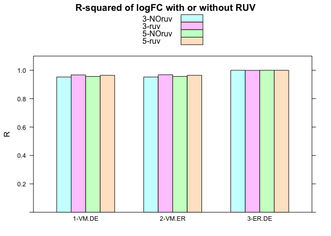
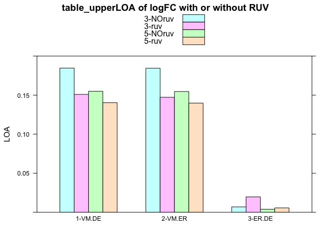
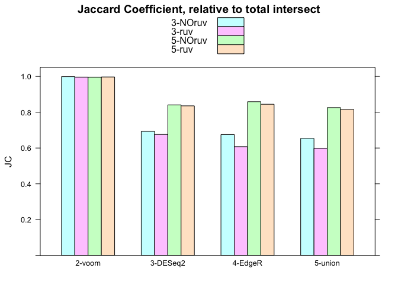

Analysis for consensusDE paper - simulation
================
Ashley J. Waardenberg
30/06/2019

-   [Notes](#notes)
-   [functions used for analysis](#functions-used-for-analysis)
-   [load libraries](#load-libraries)
-   [dataset used](#dataset-used)
-   [run simulation](#run-simulation)
-   [obtain mean R-squared of logFC](#obtain-mean-r-squared-of-logfc)
-   [Fold change SD](#fold-change-sd)
-   [Jaccard Coeffecient](#jaccard-coeffecient)
-   [Set sizes for each comparison](#set-sizes-for-each-comparison)
-   [FDR](#fdr)
-   [F1 statistic](#f1-statistic)
-   [ACCURACY statistic](#accuracy-statistic)
-   [sessionInfo](#sessioninfo)
-   [functions used](#functions-used)

Notes
=====

30-06-2019 + updated for compatability with consensusDE version 1.3.3 + setting of norm\_method = "all\_defaults" for multi\_de\_pairs

functions used for analysis
===========================

``` r
source("./functions/run_sims.r")
source("./functions/return_sims_stats.r")

# path for saving files
# where to download file, home directory, or change:
download_dir <- "~/"
```

load libraries
==============

``` r
library(consensusDE)
library(lattice)
library(metaseqR)
library(edgeR)
```

dataset used
============

``` r
# Mouse - bottomly  2 inbred mouse strains
# phenodata
# http://bowtie-bio.sourceforge.net/recount/phenotypeTables/bottomly_phenodata.txt
# count table
bottomly <- "http://bowtie-bio.sourceforge.net/recount/countTables/bottomly_count_table.txt"

download.file(url = bottomly,
              destfile = paste(download_dir, "bottomly_count_table.txt", sep=""))
```

run simulation
==============

parameters - p\_thresh = threshold for determining significance. - DE etc.

``` r
# establish datasets to model distribution
data_to_test <- c(paste(download_dir, "bottomly_count_table.txt", sep=""))

# number of replicates to test
reps <- c(3, 5)

# 1. with RUV
ruv <- lapply(seq_along(reps), function(x) 
                              wrap_all(data_to_test,
                                       p_thresh = 0.05,
                                       replicates = reps[x],
                                       ruv = TRUE))
# 2. withOUT RUV
NOruv <- lapply(seq_along(reps), function(x) 
                              wrap_all(data_to_test,
                                       p_thresh = 0.05,
                                       replicates = reps[x],
                                       ruv = FALSE))
```

obtain mean R-squared of logFC
==============================

``` r
# non-ruv
NOruv_3rep <- get_mean_FC(NOruv, 1)
NOruv_5rep <- get_mean_FC(NOruv, 2)

# ruv
ruv_3rep <- get_mean_FC(ruv, 1)
ruv_5rep <- get_mean_FC(ruv, 2)

# put all results into a table
table_R <- data.frame(c(as.numeric(apply(NOruv_3rep, 2, mean)), 
                        as.numeric(apply(ruv_3rep, 2, mean)),
                        as.numeric(apply(NOruv_5rep, 2, mean)),
                        as.numeric(apply(ruv_5rep, 2, mean))),
                      c(rep(c("3-NOruv", "3-ruv"), each = 3, 1), 
                        rep(c("5-NOruv", "5-ruv"), each = 3, 1)),
                      c(rep(c("1-VM.DE", "2-VM.ER", "3-ER.DE"), 4)))
colnames(table_R) <- c("R", "reps", "group")

# barchart of results
barchart(R~group,
         data = table_R,
         groups = reps,
         main = "R-squared of logFC with or without RUV",
         auto.key = TRUE)
```



Fold change SD
==============

``` r
# Fold Change Statistics
# non-ruv
NOruv_3rep_stats_fc <- clean_stats(NOruv, 1, isLogFC = TRUE)
NOruv_5rep_stats_fc <- clean_stats(NOruv, 2, isLogFC = TRUE)
# ruv
ruv_3rep_stats_fc <- clean_stats(ruv, 1, isLogFC = TRUE)
ruv_5rep_stats_fc <- clean_stats(ruv, 2, isLogFC = TRUE)

# Obtain the mean Fold-change Standard Deviations (SD)
# without RUV - 3 reps
mean_3rep_fc <- sapply(1:ncol(NOruv_3rep_stats_fc), function(x) mean(unlist(data.frame(NOruv_3rep_stats_fc)[x]), na.rm=TRUE))
names(mean_3rep_fc) <- colnames(NOruv_3rep_stats_fc)
# without RUV - 5 reps
mean_5rep_fc <- sapply(1:ncol(NOruv_5rep_stats_fc), function(x) mean(unlist(data.frame(NOruv_5rep_stats_fc)[x]), na.rm=TRUE))
names(mean_5rep_fc) <- colnames(NOruv_5rep_stats_fc)

# with RUV - 3 reps
mean_3rep_fc_ruv <- sapply(1:ncol(ruv_3rep_stats_fc), function(x) mean(unlist(data.frame(ruv_3rep_stats_fc)[x]), na.rm=TRUE))
names(mean_3rep_fc_ruv) <- colnames(ruv_3rep_stats_fc)
# with RUV - 5 reps
mean_5rep_fc_ruv <- sapply(1:ncol(ruv_5rep_stats_fc), function(x) mean(unlist(data.frame(ruv_5rep_stats_fc)[x]), na.rm=TRUE))
names(mean_5rep_fc_ruv) <- colnames(ruv_5rep_stats_fc)

# summary of results
mean_fc_summary <- rbind(mean_3rep_fc,
                         mean_5rep_fc,
                         mean_3rep_fc_ruv,
                         mean_5rep_fc_ruv)
```

Jaccard Coeffecient
===================

``` r
# non-ruv
NOruv_3rep_stats <- clean_stats(NOruv, 1)
NOruv_5rep_stats <- clean_stats(NOruv, 2)
# ruv
ruv_3rep_stats <- clean_stats(ruv, 1)
ruv_5rep_stats <- clean_stats(ruv, 2)

# JC for each set
# here, the first set is the intersect of all values, will normalise to 1
# 3 reps
int_3rep <- apply(NOruv_3rep_stats$TP_n, 2, mean) + apply(NOruv_3rep_stats$FP_n, 2, mean)
JC_3rep <- int_3rep[1]/int_3rep
# 5 reps
int_5rep <- apply(NOruv_5rep_stats$TP_n, 2, mean) + apply(NOruv_5rep_stats$FP_n, 2, mean)
JC_5rep <- int_5rep[1]/int_5rep

# 3 reps - with RUV
int_3rep_ruv <- apply(ruv_3rep_stats$TP_n, 2, mean) + apply(ruv_3rep_stats$FP_n, 2, mean)
JC_3rep_ruv <- int_3rep_ruv[1]/int_3rep_ruv
# 5 reps - with RUV
int_5rep_ruv <- apply(ruv_5rep_stats$TP_n, 2, mean) + apply(ruv_5rep_stats$FP_n, 2, mean)
JC_5rep_ruv <- int_5rep_ruv[1]/int_5rep_ruv

# summarize results into table
table_JC <- data.frame(c(as.numeric(JC_3rep[2:length(JC_3rep)]), 
                    as.numeric(JC_3rep_ruv[2:length(JC_3rep_ruv)]),
                    as.numeric(JC_5rep[2:length(JC_5rep)]), 
                    as.numeric(JC_5rep_ruv[2:length(JC_5rep_ruv)])),
                  c(rep(c("3-NOruv", "3-ruv"), each = 4, 1), 
                    rep(c("5-NOruv", "5-ruv"), each = 4, 1)),
                  c(rep(c("5-union", "4-EdgeR", "2-voom", "3-DESeq2"), 4)))
colnames(table_JC) <- c("JC", "reps", "group")

# plot results
barchart(JC~group,
         data = table_JC,
         groups = reps,
         main = "Jaccard Coefficient, relative to total intersect",
         auto.key = TRUE)
```



Set sizes for each comparison
=============================

``` r
# set sizes (genes call DE) for each method
size_summary <- rbind(int_3rep,
                      int_3rep_ruv,
                      int_5rep,
                      int_5rep_ruv)

size_summary
```

    ##              inter union EdgeR  voom DESeq2
    ## int_3rep     303.6 464.2 449.6 304.0  438.1
    ## int_3rep_ruv 280.8 468.8 462.2 281.9  415.5
    ## int_5rep     413.8 501.1 481.8 415.5  492.0
    ## int_5rep_ruv 411.8 505.1 487.6 413.1  492.8

FDR
===

``` r
# put FDR (mean from all simulations) into table
table_FDR <- data.frame(c(as.numeric(apply(NOruv_3rep_stats$FDR, 2, mean)), 
                          as.numeric(apply(ruv_3rep_stats$FDR, 2, mean)),
                          as.numeric(apply(NOruv_5rep_stats$FDR, 2, mean)),
                          as.numeric(apply(ruv_5rep_stats$FDR, 2, mean))),
                        c(rep(c("3-NOruv", "3-ruv"), each = 5, 1), 
                          rep(c("5-NOruv", "5-ruv"), each = 5, 1)),
                        c(rep(c("1-intersect", "5-union", "4-EdgeR", "2-voom", "3-DESeq2"), 4)))
colnames(table_FDR) <- c("FDR", "reps", "group")

# plot FDR
barchart(FDR~group,
         data = table_FDR,
         groups = reps,
         main = "False Discovery Rates",
         auto.key = TRUE)
```


F1 statistic
============

``` r
table_F1 <- data.frame(c(as.numeric(apply(NOruv_3rep_stats$F1, 2, mean)), 
                    as.numeric(apply(ruv_3rep_stats$F1, 2, mean)),
                    as.numeric(apply(NOruv_5rep_stats$F1, 2, mean)),
                      as.numeric(apply(ruv_5rep_stats$F1, 2, mean))),
                  c(rep(c("3-NOruv", "3-ruv"), each = 5, 1), 
                    rep(c("5-NOruv", "5-ruv"), each = 5, 1)),
                  c(rep(c("1-intersect", "5-union", "4-EdgeR", "2-voom", "3-DESeq2"), 4)))
colnames(table_F1) <- c("F1", "reps", "group")

barchart(F1~group,
         data = table_F1,
         groups = reps,
         main = "F1 - statistics",
         auto.key = TRUE)
```



ACCURACY statistic
==================

``` r
table_ACC <- data.frame(c(as.numeric(apply(NOruv_3rep_stats$ACC, 2, mean)), 
                    as.numeric(apply(ruv_3rep_stats$ACC, 2, mean)),
                    as.numeric(apply(NOruv_5rep_stats$ACC, 2, mean)),
                      as.numeric(apply(ruv_5rep_stats$ACC, 2, mean))),
                  c(rep(c("3-NOruv", "3-ruv"), each = 5, 1), 
                    rep(c("5-NOruv", "5-ruv"), each = 5, 1)),
                  c(rep(c("1-intersect", "5-union", "4-EdgeR", "2-voom", "3-DESeq2"), 4)))
colnames(table_ACC) <- c("ACC", "reps", "group")


barchart(ACC~group,
         data = table_ACC,
         groups = reps,
         main = "Accuracy",
         auto.key = TRUE)
```


sessionInfo
===========

``` r
sessionInfo()
```

    ## R version 3.5.1 (2018-07-02)
    ## Platform: x86_64-apple-darwin15.6.0 (64-bit)
    ## Running under: macOS High Sierra 10.13.6
    ## 
    ## Matrix products: default
    ## BLAS: /Library/Frameworks/R.framework/Versions/3.5/Resources/lib/libRblas.0.dylib
    ## LAPACK: /Library/Frameworks/R.framework/Versions/3.5/Resources/lib/libRlapack.dylib
    ## 
    ## locale:
    ## [1] en_AU.UTF-8/en_AU.UTF-8/en_AU.UTF-8/C/en_AU.UTF-8/en_AU.UTF-8
    ## 
    ## attached base packages:
    ## [1] stats4    parallel  stats     graphics  grDevices utils     datasets 
    ## [8] methods   base     
    ## 
    ## other attached packages:
    ##  [1] edgeR_3.22.5                metaseqR_1.22.1            
    ##  [3] qvalue_2.14.1               limma_3.36.5               
    ##  [5] DESeq_1.32.0                locfit_1.5-9.1             
    ##  [7] EDASeq_2.14.1               ShortRead_1.38.0           
    ##  [9] GenomicAlignments_1.16.0    SummarizedExperiment_1.10.1
    ## [11] DelayedArray_0.6.6          matrixStats_0.54.0         
    ## [13] Rsamtools_1.34.1            GenomicRanges_1.32.7       
    ## [15] GenomeInfoDb_1.16.0         Biostrings_2.48.0          
    ## [17] XVector_0.20.0              IRanges_2.14.12            
    ## [19] S4Vectors_0.18.3            BiocParallel_1.16.6        
    ## [21] Biobase_2.40.0              lattice_0.20-35            
    ## [23] consensusDE_1.3.3           BiocGenerics_0.26.0        
    ## 
    ## loaded via a namespace (and not attached):
    ##   [1] colorspace_1.3-2                         
    ##   [2] rjson_0.2.20                             
    ##   [3] hwriter_1.3.2                            
    ##   [4] htmlTable_1.12                           
    ##   [5] base64enc_0.1-3                          
    ##   [6] rstudioapi_0.7                           
    ##   [7] affyio_1.52.0                            
    ##   [8] bit64_0.9-7                              
    ##   [9] AnnotationDbi_1.44.0                     
    ##  [10] splines_3.5.1                            
    ##  [11] R.methodsS3_1.7.1                        
    ##  [12] geneplotter_1.58.0                       
    ##  [13] knitr_1.23                               
    ##  [14] Formula_1.2-3                            
    ##  [15] log4r_0.2                                
    ##  [16] baySeq_2.16.0                            
    ##  [17] annotate_1.58.0                          
    ##  [18] vsn_3.50.0                               
    ##  [19] cluster_2.0.7-1                          
    ##  [20] R.oo_1.22.0                              
    ##  [21] BiocManager_1.30.4                       
    ##  [22] compiler_3.5.1                           
    ##  [23] httr_1.3.1                               
    ##  [24] backports_1.1.2                          
    ##  [25] assertthat_0.2.1                         
    ##  [26] Matrix_1.2-14                            
    ##  [27] lazyeval_0.2.2                           
    ##  [28] airway_0.114.0                           
    ##  [29] acepack_1.4.1                            
    ##  [30] htmltools_0.3.6                          
    ##  [31] prettyunits_1.0.2                        
    ##  [32] tools_3.5.1                              
    ##  [33] bindrcpp_0.2.2                           
    ##  [34] affy_1.60.0                              
    ##  [35] gtable_0.3.0                             
    ##  [36] glue_1.3.1                               
    ##  [37] GenomeInfoDbData_1.1.0                   
    ##  [38] reshape2_1.4.3                           
    ##  [39] dplyr_0.7.8                              
    ##  [40] Rcpp_0.12.19                             
    ##  [41] TxDb.Dmelanogaster.UCSC.dm3.ensGene_3.2.2
    ##  [42] preprocessCore_1.44.0                    
    ##  [43] gdata_2.18.0                             
    ##  [44] rtracklayer_1.40.6                       
    ##  [45] xfun_0.7                                 
    ##  [46] stringr_1.4.0                            
    ##  [47] ensembldb_2.6.7                          
    ##  [48] gtools_3.8.1                             
    ##  [49] XML_3.98-1.16                            
    ##  [50] dendextend_1.12.0                        
    ##  [51] zlibbioc_1.26.0                          
    ##  [52] MASS_7.3-50                              
    ##  [53] scales_1.0.0                             
    ##  [54] aroma.light_3.10.0                       
    ##  [55] pcaMethods_1.72.0                        
    ##  [56] hms_0.4.2                                
    ##  [57] ProtGenerics_1.14.0                      
    ##  [58] AnnotationFilter_1.6.0                   
    ##  [59] RColorBrewer_1.1-2                       
    ##  [60] yaml_2.2.0                               
    ##  [61] curl_3.2                                 
    ##  [62] NBPSeq_0.3.0                             
    ##  [63] memoise_1.1.0                            
    ##  [64] RUVSeq_1.16.1                            
    ##  [65] gridExtra_2.3                            
    ##  [66] ggplot2_3.1.1                            
    ##  [67] biomaRt_2.36.1                           
    ##  [68] rpart_4.1-13                             
    ##  [69] latticeExtra_0.6-28                      
    ##  [70] stringi_1.4.3                            
    ##  [71] RSQLite_2.1.1                            
    ##  [72] genefilter_1.62.0                        
    ##  [73] corrplot_0.84                            
    ##  [74] checkmate_1.8.5                          
    ##  [75] caTools_1.17.1.1                         
    ##  [76] GenomicFeatures_1.32.3                   
    ##  [77] rlang_0.3.4                              
    ##  [78] pkgconfig_2.0.2                          
    ##  [79] bitops_1.0-6                             
    ##  [80] evaluate_0.14                            
    ##  [81] purrr_0.2.5                              
    ##  [82] bindr_0.1.1                              
    ##  [83] htmlwidgets_1.2                          
    ##  [84] bit_1.1-14                               
    ##  [85] tidyselect_0.2.5                         
    ##  [86] plyr_1.8.4                               
    ##  [87] magrittr_1.5                             
    ##  [88] DESeq2_1.20.0                            
    ##  [89] R6_2.2.2                                 
    ##  [90] gplots_3.0.1.1                           
    ##  [91] Hmisc_4.1-1                              
    ##  [92] DBI_1.0.0                                
    ##  [93] pillar_1.3.1                             
    ##  [94] foreign_0.8-71                           
    ##  [95] abind_1.4-5                              
    ##  [96] survival_2.42-6                          
    ##  [97] RCurl_1.95-4.11                          
    ##  [98] nnet_7.3-12                              
    ##  [99] tibble_2.1.1                             
    ## [100] crayon_1.3.4                             
    ## [101] KernSmooth_2.23-15                       
    ## [102] rmarkdown_1.13                           
    ## [103] viridis_0.5.1                            
    ## [104] progress_1.2.0                           
    ## [105] grid_3.5.1                               
    ## [106] data.table_1.12.2                        
    ## [107] blob_1.1.1                               
    ## [108] digest_0.6.18                            
    ## [109] xtable_1.8-3                             
    ## [110] brew_1.0-6                               
    ## [111] R.utils_2.7.0                            
    ## [112] munsell_0.5.0                            
    ## [113] NOISeq_2.26.1                            
    ## [114] viridisLite_0.3.0

functions used
==============

printing for static reference

``` r
wrap_all
```

    ## function (path_to_data, p_thresh = 0.05, replicates = 3, ruv = FALSE, 
    ##     sim_number = 10, de_number = 500, de_size = 10000) 
    ## {
    ##     set.seed(1234)
    ##     sims <- lapply(1:sim_number, function(x) run_sims(real_data = path_to_data, 
    ##         replicates = replicates, den_n = de_size, n_de = de_number, 
    ##         ruv = ruv))
    ##     sims_stats <- lapply(1:length(sims), function(x) return_stats(sims[[x]], 
    ##         p_threshold = p_thresh))
    ##     sd_stats <- lapply(1:length(sims), function(x) return_logFC_sd(sims[[x]], 
    ##         p_threshold = p_thresh))
    ##     return(list(sims = sims, stats = sims_stats, sd_stats = sd_stats))
    ## }
    ## <bytecode: 0x7fe26ef54378>

``` r
run_sims
```

    ## function (real_data = NULL, sample_table = NULL, replicates = 3, 
    ##     den_n = 10000, n_de = 500, ruv = FALSE) 
    ## {
    ##     sample_table <- data.frame(file = paste(rep(c("G1_rep", "G2_rep"), 
    ##         each = replicates), 1:replicates, sep = ""), group = rep(c("G1", 
    ##         "G2"), each = replicates))
    ##     n_de <- n_de/2
    ##     par_list <- estimate.sim.params(real.counts = real_data)
    ##     sim <- make.sim.data.sd(N = den_n, param = par_list, ndeg = c(n_de, 
    ##         n_de), samples = c(replicates, replicates))
    ##     true_de <- which(sim$truedeg != 0)
    ##     neg_de <- which(sim$truedeg == 0)
    ##     syn_data <- sim$simdata[9:ncol(sim$simdata)]
    ##     se <- SummarizedExperiment(assays = SimpleList(counts = as.matrix(syn_data)))
    ##     colData(se) <- S4Vectors::DataFrame(sample_table)
    ##     colnames(se) <- sample_table$file
    ##     keep <- filterByExpr(assays(se)$counts, group = colData(se)$group)
    ##     se <- se[rownames(se)[keep], ]
    ##     mde <- multi_de_pairs(summarized = se, ruv_correct = ruv, 
    ##         norm_method = "all_defaults", verbose = TRUE)
    ##     merged_data <- mde$merged[[1]]
    ##     TP <- data.frame(ID = names(true_de), test = 1)
    ##     TN <- data.frame(ID = names(neg_de), test = 2)
    ##     TP_TN <- rbind(TP, TN)
    ##     output <- merge(merged_data, TP_TN, by = "ID")
    ##     output <- output[order(output$rank_sum, decreasing = FALSE), 
    ##         ]
    ##     return(list(merged = output, TP = true_de, TN = neg_de, syn_data = syn_data, 
    ##         mde_all = mde))
    ## }
    ## <bytecode: 0x7fe2712442e0>

``` r
return_logFC_sd
```

    ## function (input_data, p_threshold = 0.05) 
    ## {
    ##     merged_data <- input_data$merged
    ##     stats_cont <- c()
    ##     stats_cont$inter <- mean(abs(merged_data[merged_data$p_intersect <= 
    ##         p_threshold, ]$LogFC_sd))
    ##     stats_cont$union <- mean(abs(merged_data[merged_data$p_union <= 
    ##         p_threshold, ]$LogFC_sd))
    ##     stats_cont$eR <- mean(abs(merged_data[merged_data$edger_adj_p <= 
    ##         p_threshold, ]$LogFC_sd))
    ##     stats_cont$V <- mean(abs(merged_data[merged_data$voom_adj_p <= 
    ##         p_threshold, ]$LogFC_sd))
    ##     stats_cont$DE <- mean(abs(merged_data[merged_data$deseq_adj_p <= 
    ##         p_threshold, ]$LogFC_sd))
    ##     stats_cont$eR_rest <- mean(abs(merged_data[merged_data$edger_adj_p <= 
    ##         p_threshold & merged_data$p_intersect > p_threshold, 
    ##         ]$LogFC_sd))
    ##     stats_cont$V_rest <- mean(abs(merged_data[merged_data$voom_adj_p <= 
    ##         p_threshold & merged_data$p_intersect > p_threshold, 
    ##         ]$LogFC_sd))
    ##     stats_cont$DE_rest <- mean(abs(merged_data[merged_data$deseq_adj_p <= 
    ##         p_threshold & merged_data$p_intersect > p_threshold, 
    ##         ]$LogFC_sd))
    ##     names(stats_cont) <- c("inter", "union", "EdgeR", "voom", 
    ##         "DESeq2", "EdgeR_unique", "voom_unique", "DESeq2_unique")
    ##     return(stats_cont)
    ## }
    ## <bytecode: 0x7fe26824f5b0>

``` r
return_stats
```

    ## function (input_data, p_threshold = 0.05) 
    ## {
    ##     merged_data <- input_data$merged
    ##     stats <- data.frame(ID = merged_data$ID, test = merged_data$test)
    ##     stats$inter <- ifelse(merged_data$p_intersect <= p_threshold, 
    ##         1, 2)
    ##     stats$union <- ifelse(merged_data$p_union <= p_threshold, 
    ##         1, 2)
    ##     stats$eR <- ifelse(merged_data$edger_adj_p <= p_threshold, 
    ##         1, 2)
    ##     stats$V <- ifelse(merged_data$voom_adj_p <= p_threshold, 
    ##         1, 2)
    ##     stats$DE <- ifelse(merged_data$deseq_adj_p <= p_threshold, 
    ##         1, 2)
    ##     stats_cont <- cont(stats)
    ##     names(stats_cont) <- c("inter", "union", "EdgeR", "voom", 
    ##         "DESeq2")
    ##     return(stats_cont)
    ## }
    ## <bytecode: 0x7fe26f3fb3a8>

``` r
cont_list
```

    ## function (input_data, col) 
    ## {
    ##     TP_n <- length(input_data$test[input_data$test == 1 & input_data[col] == 
    ##         1])
    ##     TN_n <- length(input_data$test[input_data$test == 2 & input_data[col] == 
    ##         2])
    ##     FP_n <- length(input_data$test[input_data$test == 2 & input_data[col] == 
    ##         1])
    ##     FN_n <- length(input_data$test[input_data$test == 1 & input_data[col] == 
    ##         2])
    ##     PPV <- TP_n/(TP_n + FP_n)
    ##     PPV[is.na(PPV)] <- NA
    ##     NPV <- TN_n/(TN_n + FN_n)
    ##     NPV[is.na(NPV)] <- NA
    ##     FDR <- FP_n/(FP_n + TP_n)
    ##     FDR[is.na(FDR)] <- NA
    ##     sens <- TP_n/(TP_n + FN_n)
    ##     sens[is.na(sens)] <- NA
    ##     spec <- TN_n/(TN_n + FP_n)
    ##     spec[is.na(spec)] <- NA
    ##     F1 <- 2 * ((PPV * sens)/(PPV + sens))
    ##     ACC <- (TP_n + TN_n)/(TP_n + TN_n + FP_n + FN_n)
    ##     results_return <- c(TP_n, TN_n, FP_n, FN_n, PPV, NPV, FDR, 
    ##         sens, spec, F1, ACC)
    ##     names(results_return) <- c("TP_n", "TN_n", "FP_n", "FN_n", 
    ##         "PPV", "NPV", "FDR", "sens", "spec", "F1", "ACC")
    ##     return(results_return)
    ## }
    ## <bytecode: 0x7fe26a8eaa88>

``` r
cont
```

    ## function (input_data) 
    ## {
    ##     list_of_results <- lapply(3:ncol(input_data), function(x) cont_list(input_data, 
    ##         x))
    ##     return(list_of_results)
    ## }
    ## <bytecode: 0x7fe26a2231f8>

``` r
get_mean_FC
```

    ## function (which_data, which_experiment) 
    ## {
    ##     count_me <- which_data[[which_experiment]]$sims
    ##     sim_no <- length(count_me)
    ##     return_r <- lapply(1:sim_no, function(x) get_r(count_me, 
    ##         x))
    ##     return_r2 <- t(data.frame(return_r))
    ##     rownames(return_r2) <- 1:sim_no
    ##     return(return_r2)
    ## }
    ## <bytecode: 0x7fe275e9e2e0>

``` r
get_r
```

    ## function (count_data, which_sim) 
    ## {
    ##     DE.short <- count_data[[which_sim]]$mde_all$deseq$short_results[[1]]
    ##     DE.short <- data.frame(logFC_DE = DE.short$logFC, ID = rownames(DE.short))
    ##     VM.short <- count_data[[which_sim]]$mde_all$voom$short_results[[1]]
    ##     VM.short <- data.frame(logFC_VM = VM.short$logFC, ID = rownames(VM.short))
    ##     ER.short <- count_data[[which_sim]]$mde_all$edger$short_results[[1]]
    ##     ER.short <- data.frame(logFC_ER = ER.short$logFC, ID = rownames(ER.short))
    ##     all_FC <- merge(merge(DE.short, VM.short, by = "ID"), ER.short, 
    ##         by = "ID")
    ##     my_r <- c(summary(lm(all_FC$logFC_VM ~ all_FC$logFC_DE))$r.squared, 
    ##         summary(lm(all_FC$logFC_VM ~ all_FC$logFC_ER))$r.squared, 
    ##         summary(lm(all_FC$logFC_ER ~ all_FC$logFC_DE))$r.squared)
    ##     names(my_r) <- c("VM.DE", "VM.ER", "ER.DE")
    ##     return(my_r)
    ## }
    ## <bytecode: 0x7fe26f70af08>

``` r
clean_stats
```

    ## function (which_data, which_experiment, isLogFC = FALSE) 
    ## {
    ##     if (isLogFC == FALSE) {
    ##         count_me <- which_data[[which_experiment]]$stats
    ##     }
    ##     if (isLogFC == TRUE) {
    ##         count_me <- which_data[[which_experiment]]$sd_stats
    ##     }
    ##     sim_no <- length(count_me)
    ##     sim_names <- names(count_me[[1]])
    ##     sim_measures <- length(sim_names)
    ##     if (isLogFC == TRUE) {
    ##         sim_stats_names <- "logFC_sd"
    ##         sim_stats_size <- 1
    ##         sim_stats_clean <- sapply(1:sim_no, function(x) data.frame(DataFrame(count_me[[x]])))
    ##         sim_stats_clean4 <- t(sim_stats_clean)
    ##     }
    ##     if (isLogFC == FALSE) {
    ##         sim_stats_names <- names(count_me[[1]][[1]])
    ##         sim_stats_size <- length(names(count_me[[1]][[1]]))
    ##         sim_stats_clean <- lapply(1:sim_no, function(x) data.frame(DataFrame(count_me[[x]])))
    ##         sim_stats_clean2 <- lapply(1:sim_stats_size, function(x) t(sapply(1:sim_no, 
    ##             function(i) sim_stats_clean[[i]][x, ])))
    ##         sim_stats_clean3 <- lapply(1:sim_stats_size, function(x) cbind(sapply(1:sim_measures, 
    ##             function(i) unlist(sim_stats_clean2[[x]][, i]))))
    ##         sim_stats_clean4 <- lapply(1:length(sim_stats_clean3), 
    ##             function(x) setNames(data.frame(sim_stats_clean3[[x]]), 
    ##                 sim_names))
    ##         names(sim_stats_clean4) <- sim_stats_names
    ##     }
    ##     return(sim_stats_clean4)
    ## }
    ## <bytecode: 0x7fe2731d3a08>
